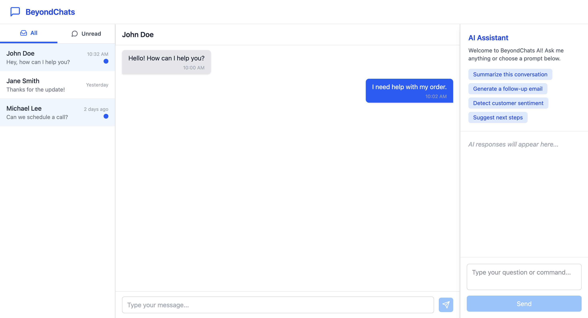

# 🚀 BeyondChats – Customer Support Admin Dashboard

**BeyondChats** is a modern, minimal, and responsive customer support admin dashboard built using **React.js** and **Tailwind CSS**. Inspired by Intercom's admin panel, this project is designed for handling user conversations, viewing chat history, and interacting with an AI assistant panel for quick support insights.

---

## 📸 Demo Preview

> 
> Example:  
> 

---

## 🔧 Features

- 📥 **Inbox Sidebar** – Lists user chats with filters (`Open`, `Waiting`, `Resolved`)
- 💬 **Chat Panel** – Displays full conversations with timestamps and agent/customer message bubbles
- 🤖 **AI Assistant** – Integrated assistant panel to suggest answers and respond to queries
- 📱 **Responsive Design** – Fully adaptable across desktop, tablet, and mobile screens
- 🎨 **Modern UI** – Clean layout with soft purples, whites, and grays

---

## 🛠️ Tech Stack

- **Frontend**: React.js, Tailwind CSS
- **Icons**: react-icons (Feather Icons)
- **State Handling**: useState (React Hooks)

---

## 📁 Folder Structure
src/
│
├── components/
│ ├── Header.jsx
│ ├── Sidebar.jsx
│ ├── ChatHeader.jsx
│ ├── ChatList.jsx
│ ├── ChatInput.jsx
│ ├── Message.jsx
│ └── AICopilot.jsx
│
├── pages/
│ └── Dashboard.jsx
│
└── App.jsx


---

## 🚀 Getting Started

### 1. Clone the Repo

```bash
git clone https://github.com/yourusername/beyondchats.git
cd beyondchats
npm install
npm run dev
npm run build

